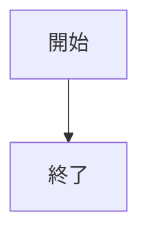
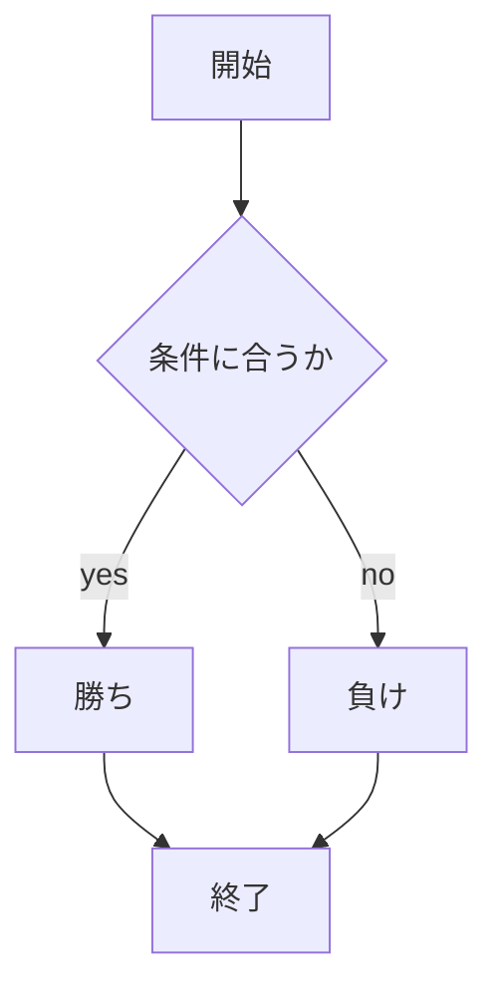

# webpro_06
10月29日
## このプログラムについて

## ファイル一覧 
   ファイル名 | 説明
-|-
app5.js | プログラムの説明
public/janken.html | じゃんけんの開始画面
```javascript
console.log('Hello');
```
1. node app5.jsを起動する
1. Webブラウザで http://localhost:8080/janken にアクセスする
1. 自分の手を入力する





