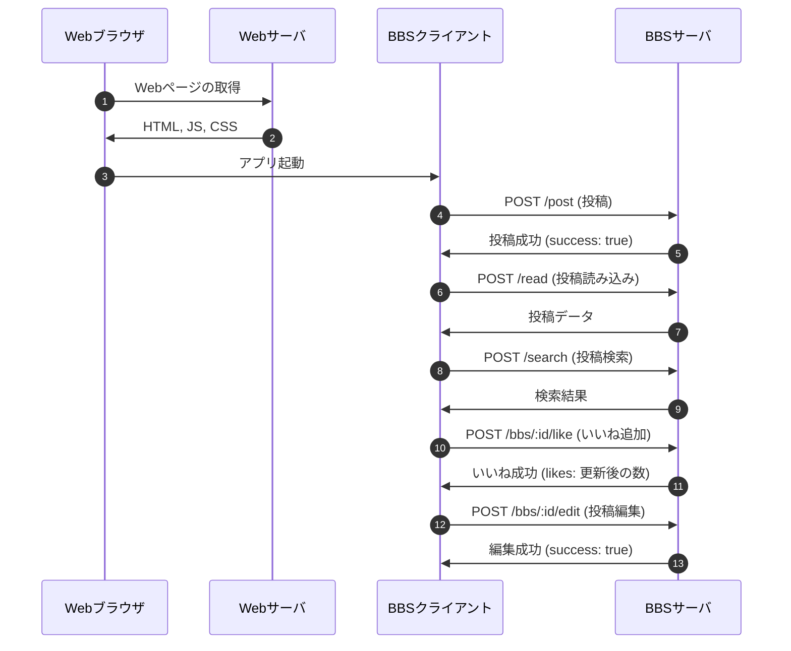

```mermaid
sequenceDiagram
  autonumber
  participant Webブラウザ
  participant Webサーバ
  participant BBSクライアント
  participant BBSサーバ
  
  Webブラウザ ->> Webサーバ: Webページの取得
  Webサーバ ->> Webブラウザ: HTML, JS, CSS
  
  Webブラウザ ->> BBSクライアント: アプリ起動
  
  BBSクライアント ->> BBSサーバ: POST /post (投稿)
  BBSサーバ ->> BBSクライアント: 投稿成功 (success: true)
  
  BBSクライアント ->> BBSサーバ: POST /read (投稿読み込み)
  BBSサーバ ->> BBSクライアント: 投稿データ
  
  BBSクライアント ->> BBSサーバ: POST /search (投稿検索)
  BBSサーバ ->> BBSクライアント: 検索結果
  
  BBSクライアント ->> BBSサーバ: POST /bbs/:id/like (いいね追加)
  BBSサーバ ->> BBSクライアント: いいね成功 (likes: 更新後の数)
  
  BBSクライアント ->> BBSサーバ: POST /bbs/:id/edit (投稿編集)
  BBSサーバ ->> BBSクライアント: 編集成功 (success: true)
```
